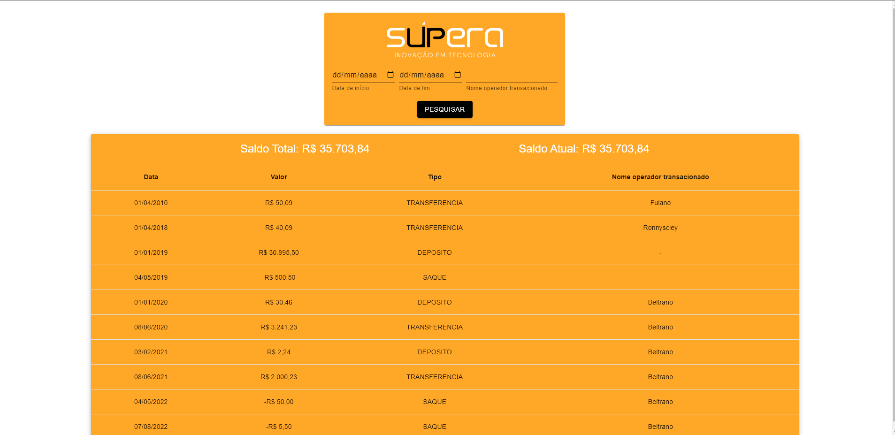

# Desafio Supera Inovação e Tecnologia 
## Front End

### Objetivo

Construir uma página para mostrar as transações realizadas/recebidas por uma pessoa usuária.

### Instruções para execução

1. Vá até o repositório do backend https://github.com/julio-silveira/supera-inovacao-backend e siga as instruções para execução;
2. Faça o clone o repositório utilizando o comando `git clone git@github.com:julio-silveira/supera-challenge-frontend.git`;
3. Utilize o comando `cd supera-challenge-frontend/` para entrar no diretório da aplicação;
4. Instale as depedências da aplicação utilizando o comando `npm install`;
5. Execute a aplicação utilizando o comando `npm run dev`;
6. Caso uma nova guia contendo a aplicação não seja aberta automaticamente, abra em seu navegador manualmente utilizando a url: `http://localhost:5173`
7. A aplicação iniciará por padrão buscando informações da pessoa usuária de id 1, para mudar para a pessoa usuária 2, acesse a url `http://localhost:5173/2` e caso uma nova pessoa usuária seja adicionada ao banco de dados, suas transações podem ser acessadas utilizando a url `http://localhost:5173/ID`.

### Tecnologias Utilizadas

- React;
- Styled Components;
- Javascript;
- React Router DOM;
- Material UI;
